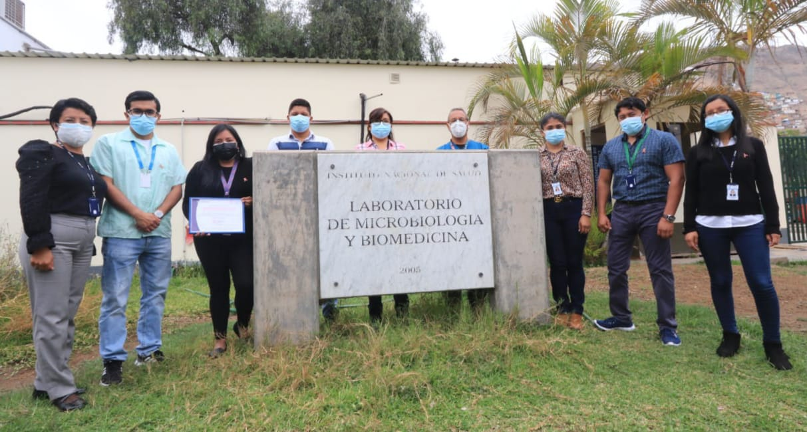
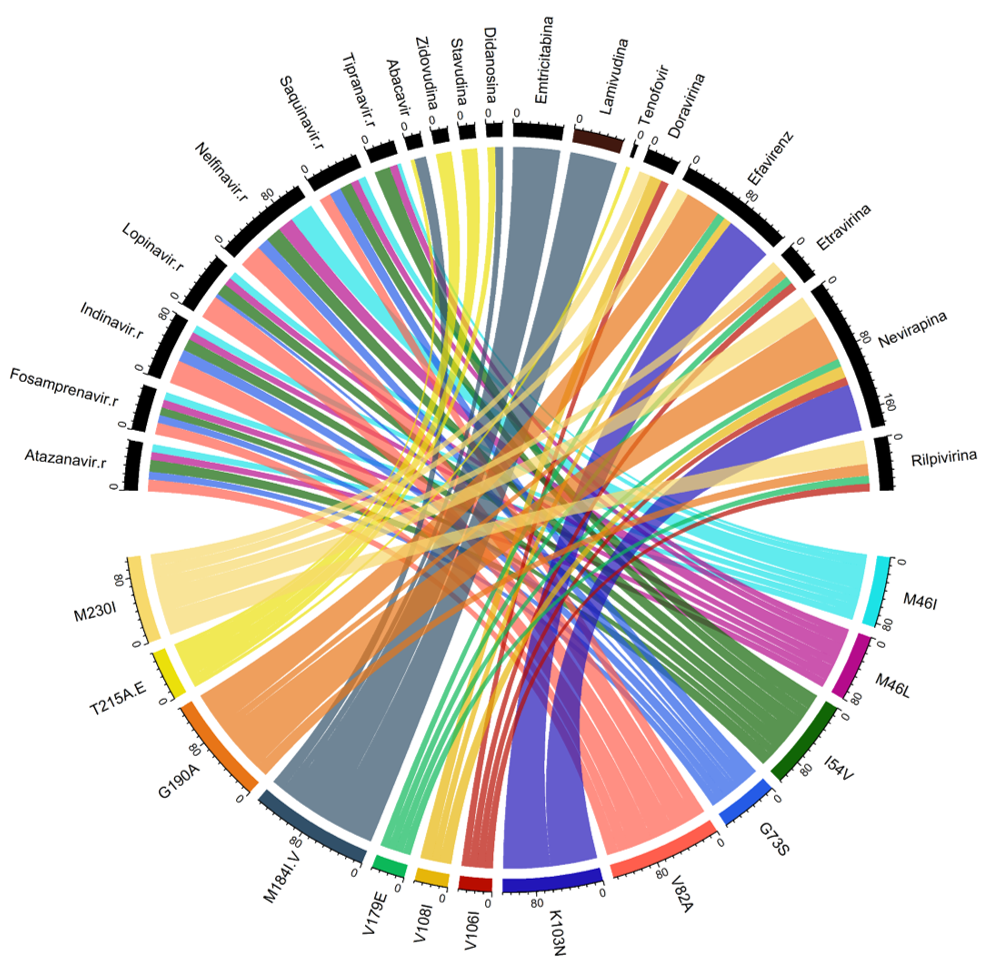
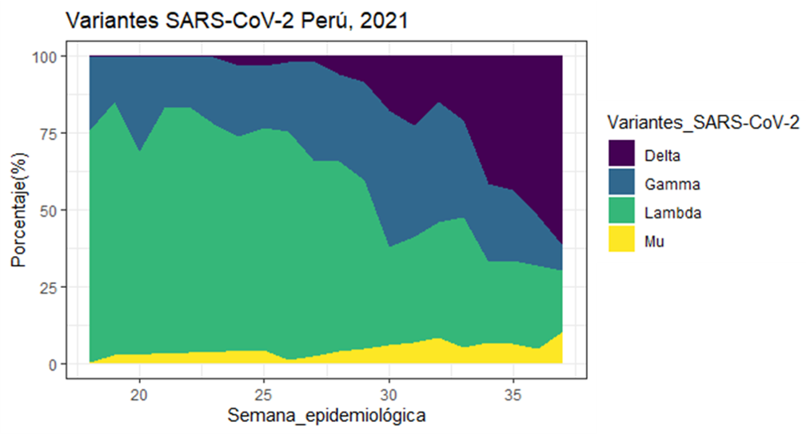
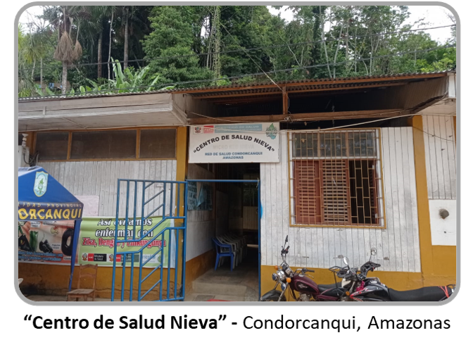
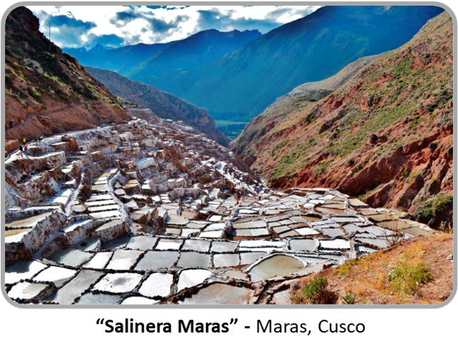
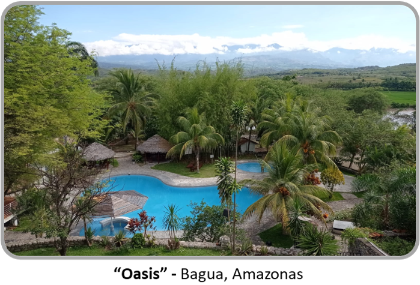
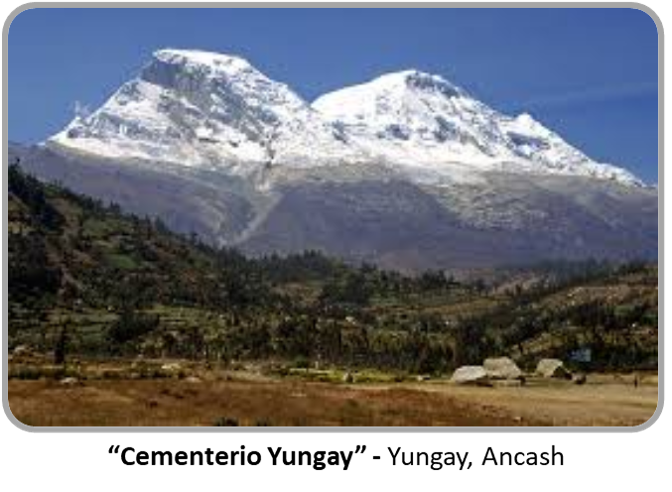
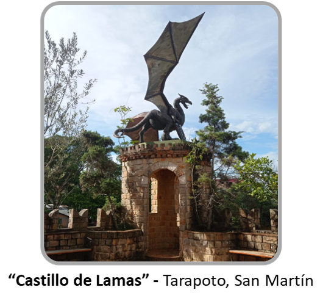

|   [HOME](README.md)  |  [EXPERIENCE](experience.md)  |  [PRODUCTION](production.md)  |   [REPOSITORIES](repositories.md)  |  [BLOG](blog.md)  | 

<h2 align="center"> Hi there  ... My name is Dilan Suárez Agüero! </h2>

 - 💼 Job: *Specialized Technical Analyst at the National Reference Laboratory for Respiratory Viruses of the National Institute of Health (Perú)*

 - 👨‍🔬 Research area of interest: *Viral Evolution and Public Health*

 - 👨‍💻 Computing areas of interest: *Bioinformatics (Genomics), Analytics and Data Visualization, Geographic Information Systems (GIS)*

 - 💻 Softwares and Programs: 

    
    
    
    
      
      
    
       
         
       

## Plots

## Places

